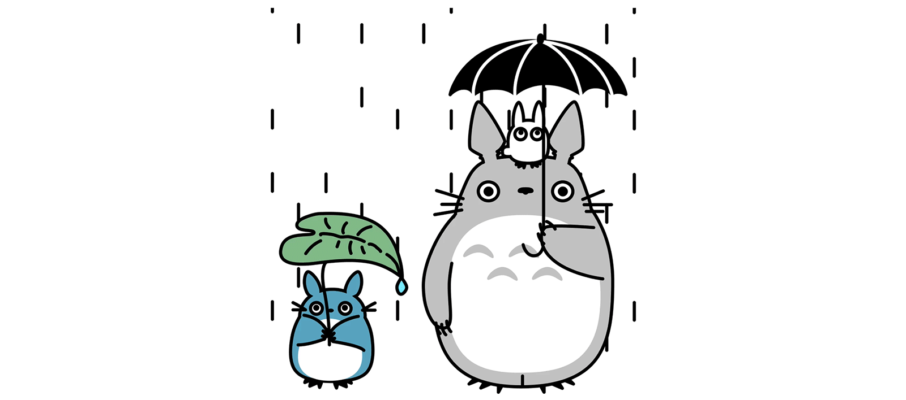

<h1 align="center">Hi there! I'm Saadia •ᴗ•</h1>

   
  
  
 I’m a computer science student focused on solving problems and driving innovation through meaningful, real-world solutions. Currently, I’m working on full-stack development, building projects that make an impact and constantly expanding my skills to tackle new challenges in tech!  

   

<h2 align="left">✧ Languages, Tools, and Frameworks</h2>

  <strong>Languages:</strong> Python, JavaScript, Java, C#, C, Elm, Haskell, HTML, CSS, PostgreSQL 
  <strong>Developer Tools and Frameworks:</strong> VS Code, Unity, Git/GitHub, IntelliJ, PyCharm, Jupyter, MongoDB, Ngrok, IHP, ReactJS, ThreeJS, NodeJS, ExpressJS, IBM Db2, Qiskit

<!--
**SaadiaM1346/SaadiaM1346** is a ✨ _special_ ✨ repository because its `README.md` (this file) appears on your GitHub profile.

Here are some ideas to get you started:

- 🔭 I’m currently working on ...
- 🌱 I’m currently learning ...
- 👯 I’m looking to collaborate on ...
- 🤔 I’m looking for help with ...
- 💬 Ask me about ...
- 📫 How to reach me: ...
- 😄 Pronouns: ...
- ⚡ Fun fact: ...
-->
